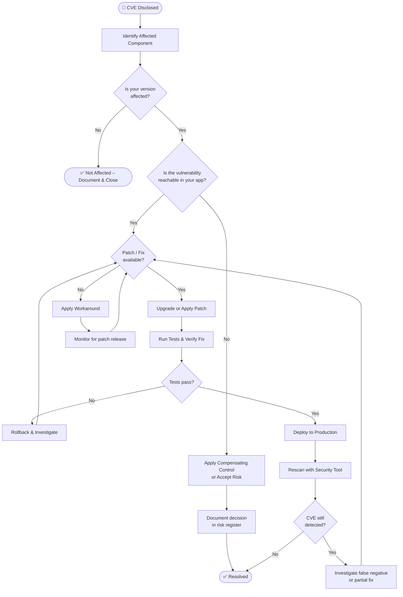

# CVE Issues – Quick Reference Guide 🔍

> **Goal:** Understand what CVEs are, how to verify them in your environment, and how to resolve them — in under 15 minutes.

---

## 🧩 What Is a CVE?

A **CVE (Common Vulnerabilities and Exposures)** is a publicly disclosed security vulnerability assigned a unique identifier by [MITRE](https://cve.mitre.org/).

| Field | Example |
|-------|---------|
| **ID** | `CVE-2021-44228` |
| **Severity (CVSS)** | 10.0 / Critical |
| **Affected software** | Apache Log4j 2.x |
| **Description** | Remote code execution via JNDI lookup |
| **Fix** | Upgrade to Log4j ≥ 2.17.1 |

### CVSS Severity Ratings

| Score | Severity |
|-------|----------|
| 9.0 – 10.0 | 🔴 Critical |
| 7.0 – 8.9 | 🟠 High |
| 4.0 – 6.9 | 🟡 Medium |
| 0.1 – 3.9 | 🟢 Low |
| 0.0 | ⚪ None |

---

## 🔎 CVE Verification Strategy

Before spending time on remediation, confirm the CVE actually affects your system.

### Step 1 – Identify the Affected Component

```bash
# Check a Java dependency version (Maven)
mvn dependency:tree | grep log4j

# Check an npm package version
npm list | grep package-name

# Check an OS package (Debian/Ubuntu)
dpkg -l | grep openssl

# Check an OS package (RHEL/CentOS)
rpm -qa | grep openssl
```

### Step 2 – Cross-Reference Against the CVE Database

| Resource | URL |
|----------|-----|
| NVD (NIST) | https://nvd.nist.gov/vuln/search |
| MITRE CVE | https://cve.mitre.org |
| GitHub Advisory DB | https://github.com/advisories |
| OSV (Open Source Vulns) | https://osv.dev |

### Step 3 – Determine Exploitability in Your Context

Ask these questions:

- ☑ Is the vulnerable code path actually reachable in your application?
- ☑ Is the affected feature enabled and exposed?
- ☑ Is there network access to the affected component?
- ☑ Are there compensating controls already in place (WAF, network segmentation)?

> 💡 **Tip:** A CVSS score of 9.8 on a library you don't call in production is lower real-world risk than a CVSS 5.0 on a publicly exposed endpoint.

---

## 🛠️ CVE Resolution Strategy

### Triage Priority Matrix

| Exploitability | Exposure | Priority |
|----------------|----------|----------|
| Known exploit exists | Public-facing | 🔴 P0 – Fix immediately |
| PoC available | Internal service | 🟠 P1 – Fix within 7 days |
| No public exploit | Internal only | 🟡 P2 – Fix within 30 days |
| Theoretical only | Not reachable | 🟢 P3 – Backlog / accept risk |

### Resolution Options (in order of preference)

1. **Upgrade** – Update the dependency/package to a patched version *(preferred)*
2. **Patch** – Apply a vendor-supplied patch
3. **Workaround** – Disable the vulnerable feature or code path
4. **Compensating Control** – Add WAF rule, network policy, or runtime protection
5. **Accept Risk** – Document formally if the vulnerability is not exploitable in your context

### Common Fix Commands

```bash
# Upgrade an npm dependency
npm update <package-name>
npm audit fix

# Upgrade a Maven dependency (update pom.xml version, then)
mvn versions:use-latest-releases

# Upgrade a pip package
pip install --upgrade <package-name>

# Upgrade an OS package (Debian/Ubuntu)
sudo apt-get update && sudo apt-get upgrade <package-name>

# Upgrade an OS package (RHEL/CentOS)
sudo yum update <package-name>
```

---

## 🔄 CVE Lifecycle Diagram



---

## 🤖 Automated Scanning Tools

| Tool | Ecosystem | Free Tier |
|------|-----------|-----------|
| **Dependabot** | GitHub – all major ecosystems | ✅ Yes |
| **Trivy** | Containers, IaC, OS packages | ✅ Yes |
| **Snyk** | Code, containers, IaC | ✅ Limited |
| **OWASP Dependency-Check** | Java, .NET, Node, Python | ✅ Yes |
| **Grype** | Containers, SBOM | ✅ Yes |
| **npm audit** | Node.js | ✅ Built-in |
| **pip-audit** | Python | ✅ Yes |

### Quick Trivy Scan (Docker Image)

```bash
# Scan a container image for CVEs
trivy image nginx:latest

# Scan a local filesystem
trivy fs ./my-project

# Scan and output only HIGH/CRITICAL
trivy image --severity HIGH,CRITICAL nginx:latest
```

---

## 📋 CVE Response Checklist

Use this checklist every time a new CVE is reported for your stack:

- [ ] **Identify** – Confirm the affected component and version in your system
- [ ] **Verify** – Check NVD/GitHub Advisory for full details and CVSS score
- [ ] **Assess** – Determine if the code path is reachable and the feature is in use
- [ ] **Triage** – Assign a P0–P3 priority based on exploitability and exposure
- [ ] **Remediate** – Upgrade, patch, or apply workaround
- [ ] **Test** – Run regression tests to confirm the fix doesn't break anything
- [ ] **Rescan** – Verify the CVE no longer appears in scanning tools
- [ ] **Document** – Record the CVE, decision, and fix in your risk/change log
- [ ] **Notify** – Inform stakeholders if the CVE affects a customer-facing system

---

## 🔗 Quick Reference Links

| Resource | Purpose |
|----------|---------|
| [NVD Search](https://nvd.nist.gov/vuln/search) | Look up any CVE ID |
| [CVSSv3 Calculator](https://www.first.org/cvss/calculator/3.1) | Calculate your contextual score |
| [EPSS Score](https://www.first.org/epss) | Probability the CVE will be exploited |
| [CISA KEV Catalog](https://www.cisa.gov/known-exploited-vulnerabilities-catalog) | Known actively-exploited CVEs |
| [OSV Dev](https://osv.dev) | Open-source vulnerability database |
